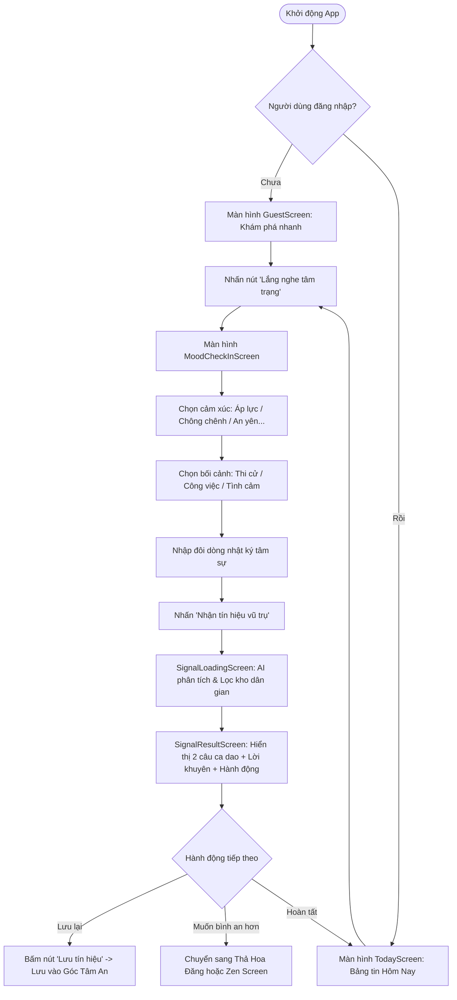
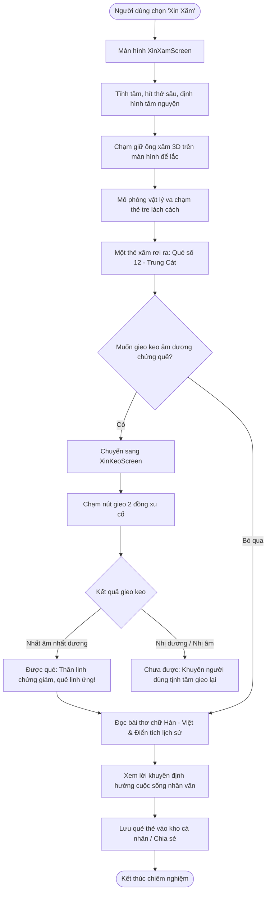
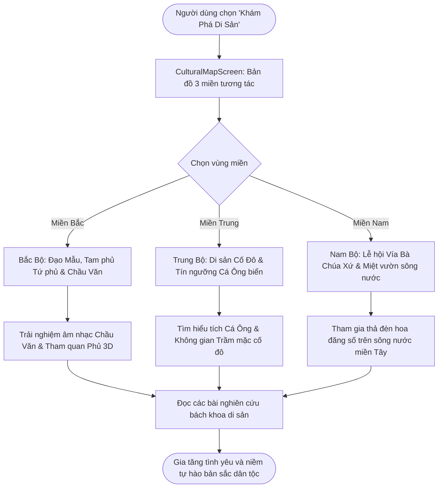
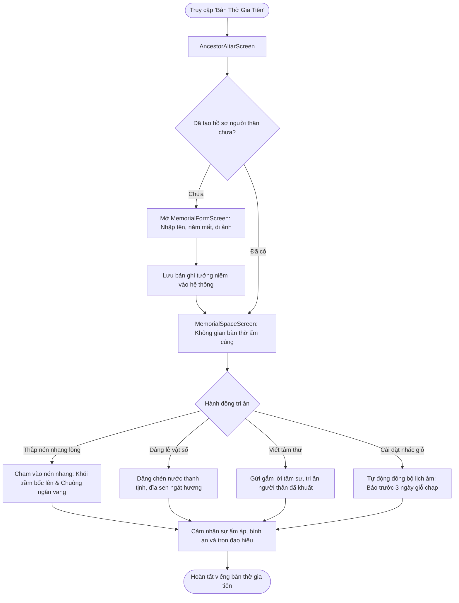
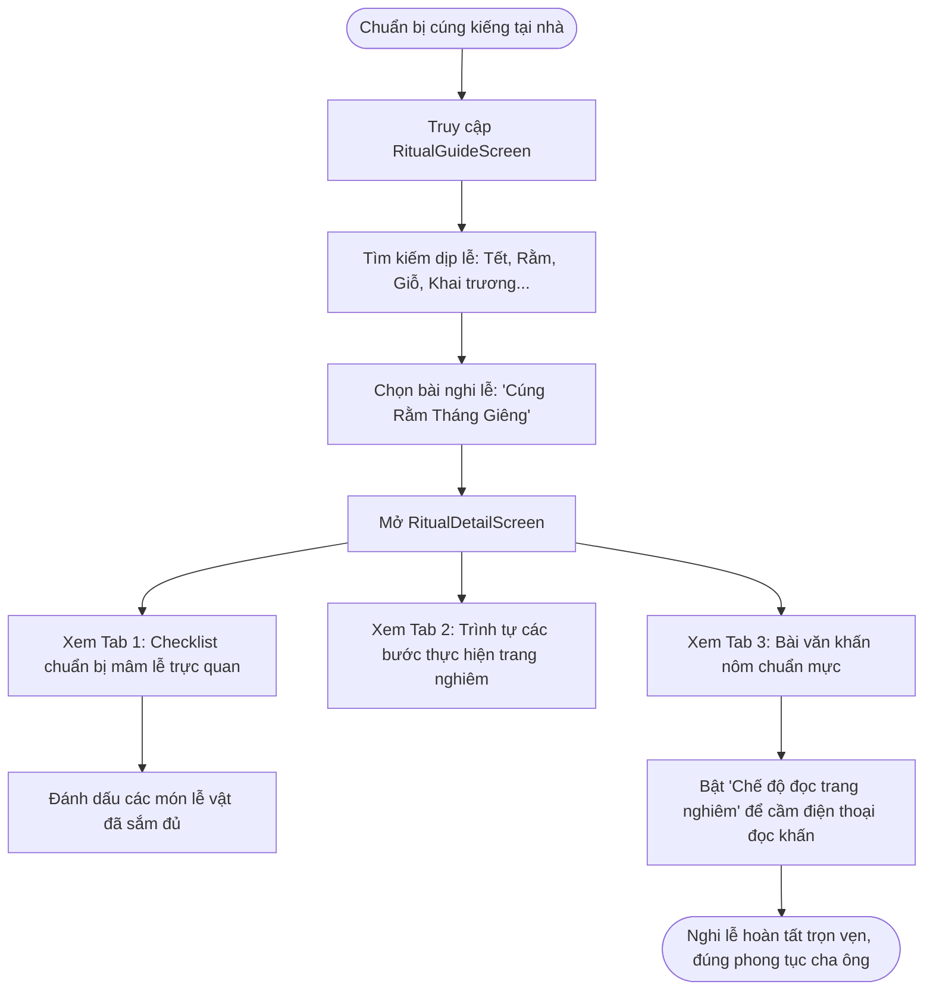
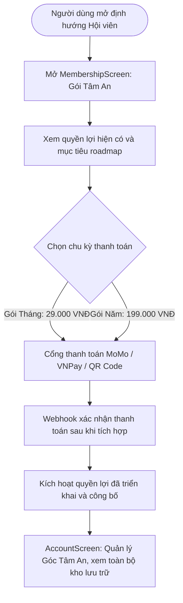

# ĐỀ ÁN KHỞI NGHIỆP EXE101 - FPT UNIVERSITY
# TÀI LIỆU YÊU CẦU DỰ ÁN TỔNG HỢP (SRS) & KỊCH BẢN DEMO THỰC CHIẾN TOP 1
## DỰ ÁN: "TIN LẮM TÂM LINH" (THƯƠNG HIỆU: THÍCH CÚNG KIẾNG)
### HỆ SINH THÁI SỐ BẢO TỒN VĂN HÓA TÍN NGƯỠNG & ĐỒNG HÀNH TINH THẦN CHO THẾ HỆ TRẺ VIỆT NAM


## PHẠM VI MVP VÀ TRẠNG THÁI TRIỂN KHAI (CẬP NHẬT 09/10/2026)

Tài liệu này giữ cả tầm nhìn sản phẩm và yêu cầu tương lai. MVP hiện có một số cảnh 3D/WebGL ở bàn thờ và trải nghiệm vùng miền; điều đó không đồng nghĩa mọi luồng 3D đã hoàn thiện. Xin xăm 3D, tích hợp hoa đăng từ `WishScreen`, gói năm 199.000đ, thư viện hội viên độc quyền và các quyền lợi Premium ngoài diễn giải AI là **lộ trình**, chưa phải chức năng đã bàn giao. Gói hội viên chưa thể mua/kích hoạt; các khoản giá và vật phẩm trong phần mô hình kinh doanh là giả định đề xuất.

Kho hiện có 14 mục bài văn hóa phía FE; chưa có bộ hơn 200 bài được bàn giao và thẩm định. Kiểm tra hiện tại có 0 nhóm thẻ xin xăm đủ điều kiện xuất bản. Các con số 200+ trong đặc tả là mục tiêu roadmap, không phải nội dung đã có. Mọi bài và quẻ phải có nguồn, quyền sử dụng và thẩm định trước khi gắn trạng thái đã xác minh; dữ liệu thiếu không được tự viết thêm để đủ số lượng. Tử vi AI hiện chỉ tạo diễn giải để suy ngẫm, không tính lá số. SMTP, Gemini và VAPID đã có giá trị cấu hình trong BE/.env nhưng chưa được xác thực hoặc kiểm thử hoạt động thực tế. Thông tin merchant VNPay và hotline chính thức của trường chưa được cấu hình nên chưa thể kiểm thử các tích hợp này.

Các yêu cầu 3D/WebGL, mở rộng nội dung, quyền lợi hội viên theo năm và vật phẩm số trong các phần sau được hiểu là **roadmap** trừ khi mục đó ghi rõ đã có trong MVP. Gói tháng chỉ khả dụng khi cổng thanh toán được cấu hình.

---

* **Môn học:** EXE101 – Khởi nghiệp (Experiential Entrepreneurship) – FPT University
* **Tên đề án:** Tin Lắm Tâm Linh (Thích Cúng Kiếng)
* **Phiên bản tài liệu:** v4.0 – Master Edition (Tối ưu hóa điểm số Top 1 & Bảo vệ trước Hội đồng)
* **Mục tiêu tài liệu:** Cung cấp đầy đủ toàn bộ chứng cứ khoa học, khảo sát thực nghiệm thị trường, bảng đặc tả yêu cầu phần mềm chuẩn IEEE/Agile (User Stories & Acceptance Criteria), Kiến trúc dữ liệu/API, Sơ đồ luồng nghiệp vụ chi tiết, Mô hình tài chính Unit Economics và Kịch bản Demo trực tiếp 7 phút có phương án dự phòng (Contingency Plan) để chinh phục điểm tuyệt đối từ Giảng viên và Ban Giám khảo.

---

## MỤC LỤC TỔNG QUAN

1. [I. TỔNG QUAN ĐỀ ÁN KHỞI NGHIỆP & KHẢO SÁT THỰC NGHIỆM](#i-tổng-quan-đề-án-khởi-nghiệp--khảo-sát-thực-nghiệm)
   - 1. Tên dự án, Slogan và Định vị thương hiệu
   - 2. Bằng chứng thị trường & Dữ liệu khảo sát thực tế (Customer Discovery Survey)
   - 3. Nỗi đau cốt lõi của khách hàng (Problem Statement)
   - 4. Giải pháp đột phá (Solution) & Tuyên ngôn giá trị (UVP)
   - 5. Bảng Lean Canvas khởi nghiệp chuẩn FPTU
2. [II. PHÂN TÍCH THỊ TRƯỜNG, ĐỐI THỦ & KHÁCH HÀNG MỤC TIÊU](#ii-phân-tích-thị-trường-đối-thủ--khách-hàng-mục-tiêu)
   - 1. Chân dung khách hàng trọng tâm (3 Personas chuyên sâu)
   - 2. Định lượng quy mô thị trường (TAM - SAM - SOM)
   - 3. Ma trận phân tích đối thủ cạnh tranh (Competitive Matrix)
   - 4. Lợi thế cạnh tranh bất công (Unfair Advantage)
3. [III. KIẾN TRÚC KỸ THUẬT & DỮ LIỆU HỆ THỐNG](#iii-kiến-trúc-kỹ-thuật--dữ-liệu-hệ-thống)
   - 1. Kiến trúc phân tầng (Multi-tier Architecture)
   - 2. Frontend & Đồ họa tương tác WebGL Canvas
   - 3. Backend RESTful API & Mô hình dữ liệu Prisma ORM (ERD Data Dictionary)
   - 4. Bảng thông số kỹ thuật các Endpoint API chính (API Contracts)
   - 5. Trí tuệ nhân tạo (Sentiment Context & AI Matching Engine)
   - 6. Cơ chế Offline-first, Bộ đệm LocalStorage & Bảo mật dữ liệu
4. [IV. ĐẶC TẢ YÊU CẦU CHỨC NĂNG CHUẨN AGILE/SRS (8 MODULES)](#iv-đặc-tả-yêu-cầu-chức-năng-chuẩn-agilesrs-8-modules)
   - Ma trận phân loại ưu tiên tính năng MoSCoW
   - Module 1: Mood Check-in & Tín Hiệu Vũ Trụ Bản Sắc Việt
   - Module 2: Chiêm Nghiệm, Xin Xăm & Xin Keo Tương Tác 2D/3D
   - Module 3: Hòm Thư Điều Ước & Thả Hoa Đăng Số
   - Module 4: Zen Space – Không Gian Tĩnh Lặng & Chánh Niệm
   - Module 5: Virtual Sanctuary – Điện Thờ 3D & Nén Nhang Lòng Tri Ân Gia Tiên
   - Module 6: Bản Đồ Di Sản Ba Miền & Kho Tri Thức Văn Hóa Dân Gian
   - Module 7: Lịch Văn Hóa, Tra Cứu Ngày Lành & Cẩm Nang Nghi Lễ Chuẩn Mực
   - Module 8: Chiêm Tinh, Tử Vi AI, Gói Hội Viên "Tâm An" & Quản Lý Hồ Sơ
5. [V. SƠ ĐỒ LUỒNG TRẢI NGHIỆM CHI TIẾT (END-TO-END MERMAID FLOWS)](#v-sơ-đồ-luồng-trải-nghiệm-chi-tiết-end-to-end-mermaid-flows)
   - Flow 1: Luồng Đồng Hành Tinh Thần & Chữa Lành Nhanh
   - Flow 2: Luồng Xin Xăm & Xin Keo Âm Dương Hoàn Chỉnh
   - Flow 3: Luồng Khám Phá Di Sản Ba Miền & Tương Tác Văn Hóa
   - Flow 4: Luồng Bàn Thờ Gia Tiên, Thắp Nhang Ảo & Nhắc Giỗ Chạp
   - Flow 5: Luồng Tra Cứu Nghi Lễ, Mâm Cúng & Văn Khấn Chuẩn
   - Flow 6: Luồng Đăng Ký Hội Viên & Quản Lý Góc Tâm An
6. [VI. KỊCH BẢN DEMO THỰC CHIẾN PITCHING ĐẠT ĐIỂM TỐI ĐA (7-MINUTE SCRIPT)](#vi-kịch-bản-demo-thực-chiến-pitching-đạt-điểm-tối-đa-7-minute-script)
   - Phân vai, Thiết lập sân khấu & Danh mục thiết bị chuẩn bị
   - Chi tiết từng phút kịch bản (0:00 - 7:00) kèm thao tác và lời thoại "chạm cảm xúc"
   - Kế hoạch B (Technical Contingency Plan) phòng ngừa rủi ro mất mạng phòng thi
7. [VII. MÔ HÌNH KINH DOANH, ĐƠN VỊ KINH TẾ & TÀI CHÍNH](#vii-mô-hình-kinh-doanh-đơn-vị-kinh-tế--tài-chính)
   - 1. Phân tích kinh tế đơn vị (Unit Economics: CAC, LTV, ARPU, Payback Period)
   - 2. Các nguồn doanh thu cốt lõi (Revenue Breakdown)
   - 3. Bảng dự phóng tài chính 12 tháng (P&L Forecast)
   - 4. Điểm hòa vốn và độ nhạy tài chính (Break-even Sensitivity)
8. [VIII. CHIẾN LƯỢC GO-TO-MARKET (GTM) & ĐO LƯỜNG TĂNG TRƯỞNG](#viii-chiến-lược-go-to-market-gtm--đo-lường-tăng-trưởng)
   - 1. Chiến lược thâm nhập Campus FPTU & Viral Loop TikTok/Threads
   - 2. Lộ trình phát triển 3 giai đoạn (Roadmap)
   - 3. Bộ chỉ số đo lường sản phẩm (Pirate Metrics: AARRR Framework)
9. [IX. BỘ NGUYÊN TẮC ĐẠO ĐỨC & QUẢN TRỊ RỦI RO PHÁP LÝ](#ix-bộ-nguyên-tắc-đạo-đức--quản-trị-rủi-ro-pháp-lý)
   - 1. Tuyên ngôn phòng chống mê tín dị đoan và thương mại hóa nỗi sợ
   - 2. Quản trị bản quyền nội dung & Thẩm định văn hóa dân gian
   - 3. Bảo vệ dữ liệu cá nhân & An toàn tâm lý học đường
10. [X. BỘ 10 CÂU HỎI & ĐÁP ÁN PHẢN BIỆN "SÁT HẠCH" CỦA HỘI ĐỒNG EXE101](#x-bộ-10-câu-hỏi--đáp-án-phản-biện-sát-hạch-của-hội-đồng-exe101)

---

## I. TỔNG QUAN ĐỀ ÁN KHỞI NGHIỆP & KHẢO SÁT THỰC NGHIỆM

### 1. Tên dự án, Slogan và Định vị thương hiệu

* **Tên đề án khởi nghiệp:** **TIN LẮM TÂM LINH**
* **Tên ứng dụng người dùng:** **Thích Cúng Kiếng**
* **Slogan định vị:** *"Chạm nét linh thiêng – An yên nếp sống trẻ"*
* **Định vị cốt lõi (tầm nhìn):** Nền tảng số đa phương tiện kết hợp **Sức khỏe tinh thần (Mental Wellness)** và **Chuyển đổi số di sản văn hóa tín ngưỡng dân gian ba miền (Cultural Heritage Digitization)**; MVP hiện có một số cảnh WebGL, còn các luồng tương tác 3D và AI cần được đánh giá theo từng tính năng/cấu hình.

```
       [TÂM LINH TRUYỀN THỐNG VIỆT NAM]
      (Đạo Mẫu, Tiền nhân, Lễ nghi, Triết lý)
                     ▲
                     │   Hệ sinh thái:
                     │   TIN LẮM TÂM LINH
                     ▼
        [CÔNG NGHỆ SỐ HIỆN ĐẠI] ────────► [ĐỒNG HÀNH TINH THẦN GEN Z]
        (3D WebGL, Trí tuệ AI)            (Thấu cảm, Chữa lành, Tích cực)
```

---

### 2. Bằng chứng thị trường & Dữ liệu khảo sát thực tế (Customer Discovery Survey)

Để chứng minh **Problem-Solution Fit** trước Hội đồng Thẩm định EXE101, nhóm đã thực hiện khảo sát định lượng và phỏng vấn sâu trên tệp **382 sinh viên và người trẻ đi làm (18 – 26 tuổi)** tại Đại học FPT (Hà Nội, TP.HCM, Cần Thơ) cùng các trường đại học lân cận (RMIT, Kinh tế TP.HCM, KHXH&NV):

* **81.4% (311/382)** người được hỏi thừa nhận thường xuyên gặp cảm giác cô đơn, áp lực học tập/thi cử, mất phương hướng sự nghiệp và cần một điểm tựa tinh thần để an tâm.
* **76.2% (291/382)** đã từng xem Tarot, tử vi, bói bài hoặc tìm kiếm "tín hiệu vũ trụ" online ít nhất 1 lần/tháng để xoa dịu cảm xúc.
* **89.5% (342/382)** muốn tìm hiểu phong tục cúng kiếng, mâm lễ, văn khấn chuẩn mực nhưng không biết hỏi ai vì cha mẹ ở xa, tài liệu trên mạng thì rời rạc, tam sao thất bản.
* **92.1% (352/382)** cảm thấy bức xúc, lo ngại trước các hiện tượng mê tín dị đoan, hù dọa vận hạn, bùa ngải lừa đảo kiếm tiền ngoài xã hội.
* **68.8% (263/382)** sẵn sàng trả mức phí nhỏ (tương đương 20.000 – 35.000 VNĐ/tháng) cho một nền tảng văn hóa chuẩn xác, giao diện đẹp mắt, giúp thắp nhang tri ân gia tiên và nhận thông điệp tích cực mỗi ngày.

---

### 3. Nỗi đau cốt lõi của khách hàng (Problem Statement)

1. **Khủng hoảng hiện sinh của thế hệ số (Quarter-life Crisis):**
   - Gen Z đối mặt với áp lực cạnh tranh khốc liệt, peer-pressure (áp lực đồng trang lứa), sợ tụt hậu (FOMO) và sự đứt gãy kết nối cảm xúc gia đình. Khi bế tắc, họ cần lời an ủi tức thời, không phán xét.
2. **Sự xa cách với cội nguồn văn hóa bản địa:**
   - Người trẻ sống trọ xa nhà, du học sinh không có điều kiện lập bàn thờ. Khi đến ngày Giỗ, Tết, Rằm, họ muốn tỏ lòng hiếu kính nhưng lực bất tòng tâm.
   - Các nghi thức truyền thống bị xem là cổ hủ, rườm rà do thiếu phương thức truyền đạt hiện đại, trực quan.
3. **Vấn nạn thương mại hóa nỗi sợ hãi & Mê tín dị đoan:**
   - Nhiều kênh tâm linh trên mạng lợi dụng tâm lý bất an để trục lợi: ép cúng giải hạn hàng triệu đồng, bói toán hù dọa điều xui xẻo, gây khủng hoảng tâm lý trầm trọng cho người trẻ.

---

### 4. Giải pháp đột phá (Solution) & Tuyên ngôn giá trị (UVP)

**Tầm nhìn giải pháp (định hướng, không phải danh sách chức năng MVP đã bàn giao):** **Tin Lắm Tâm Linh** hướng tới giải quyết 3 nỗi đau trên bằng cách tiếp cận **"Tín ngưỡng vị nhân sinh – Tinh giản và Nhân bản"**:

* **Chữa lành bằng văn hóa Việt:** Biến ca dao, tục ngữ, tích xưa thành lời động viên tâm lý ấm áp thông qua tính năng *Mood Check-in*.
* **Số hóa nghi thức:** Hướng tới cẩm nang mâm cúng, văn khấn có nguồn và được thẩm định, checklist đồ lễ và chế độ đọc trang nghiêm.
* **Trải nghiệm tương tác:** Một số cảnh 3D/WebGL bàn thờ và vùng miền đã có; xin xăm 3D và âm thanh chuông 432Hz vẫn là yêu cầu/lộ trình, chưa được xác nhận trong MVP.
* **Bảo tàng số 3 miền:** Đưa người trẻ khám phá di sản Đạo Mẫu Bắc Bộ, văn hóa biển miền Trung, lễ hội Vía Bà phương Nam một cách tự hào, văn minh.

**Tuyên ngôn giá trị (UVP):**
> *"Điểm tựa tinh thần an yên của thế hệ trẻ Việt Nam – Nơi công nghệ đưa di sản tín ngưỡng cha ông vào nhịp sống hiện đại, không hù dọa, không phán xét, thuần túy nuôi dưỡng bình an và lòng biết ơn cội nguồn."*

---

### 5. Bảng Lean Canvas khởi nghiệp chuẩn FPTU

| Thành phần Canvas | Nội dung đề án "Tin Lắm Tâm Linh" |
| :--- | :--- |
| **1. Vấn đề (Problem)** | - Gen Z căng thẳng, cô đơn, chông chênh trước các bước ngoặt cuộc sống.<br>- Thiếu kiến thức phong tục truyền thống; sinh viên sống trọ không có không gian cúng kiếng.<br>- Mê tín dị đoan ngoài xã hội thao túng tâm lý, trục lợi tài chính. |
| **2. Phân khúc khách hàng (Customer Segments)** | - *Chính yếu:* Sinh viên đại học (18–22 tuổi) tại FPTU, RMIT, HUB, UEH, VNU...<br>- *Thứ cấp:* Người trẻ mới đi làm (23–28 tuổi) chịu áp lực công việc đô thị.<br>- *Mở rộng:* Du học sinh, kiều bào xa quê muốn hướng về cội nguồn gia tiên. |
| **3. Tuyên ngôn giá trị độc nhất (UVP, mục tiêu)** | *"Hệ sinh thái tâm linh số bản sắc Việt – Điểm tựa tinh thần an yên, kết nối cội nguồn bằng trải nghiệm số và AI có trách nhiệm."* Đây là định vị đề xuất, không phải cam kết mọi công nghệ đã hoàn tất. |
| **4. Giải pháp (Solution, gồm MVP và hướng phát triển)** | - MVP: Mood Check-in với lời gợi mở; nội dung dân gian cần kiểm chứng nguồn trước khi gọi là trích dẫn.<br>- MVP: xin xăm dạng tương tác hiện có và gieo keo; nội dung quẻ chưa đủ điều kiện xuất bản đầy đủ.<br>- Một số cảnh bàn thờ/vùng miền 3D đang có; các nghi thức và tương tác mở rộng còn theo lộ trình.<br>- Cẩm nang, lịch văn hóa và quản lý hồ sơ được mở rộng sau khi hoàn tất biên tập/kiểm chứng. |
| **5. Kênh tiếp cận (Channels)** | - Trực tiếp tại Campus: QR code chiến dịch mùa thi, CLB Văn hóa, sự kiện Vu Lan/Tết.<br>- Trực tuyến: Kênh TikTok/Threads viral "Tín hiệu vũ trụ dân gian", Instagram Aesthetic.<br>- Hợp tác: Hội sinh viên, các bảo tàng, làng nghề thủ công truyền thống. |
| **6. Dòng doanh thu (giả định mô hình, chưa phát sinh trong MVP)** | - Đề xuất gói hội viên "Tâm An" (29k/tháng hoặc 199k/năm); chưa mở thanh toán/kích hoạt.<br>- Vật phẩm số trang trí (9k–49k) là ý tưởng; chưa bán trong MVP.<br>- Hợp tác B2B/quà tặng văn hóa là hướng khảo sát, chưa phải doanh thu hiện có. |
| **7. Cơ cấu chi phí (Cost Structure)** | - Hạ tầng máy chủ Cloud, Database, CDN tài nguyên 3D/Audio: ~25%.<br>- Chi phí Marketing, Campus Tour & Vận hành cộng đồng: ~40%.<br>- Chi phí Nghiên cứu, Cố vấn văn hóa & Bản quyền tư liệu: ~20%.<br>- Quản lý vận hành & Chi phí dự phòng: ~15%. |
| **8. Chỉ số then chốt (Key Metrics)** | - DAU / MAU (Daily/Monthly Active Users).<br>- Retention Rate (D1 > 45%, D7 > 35%, D30 > 22%).<br>- Tỷ lệ chuyển đổi Freemium -> Premium (> 4.8%).<br>- LTV / CAC Ratio (> 10x). |
| **9. Lợi thế cần xây dựng (chưa phải lợi thế đã được chứng minh)** | - Xây dựng kho ngữ liệu văn hóa dân gian có nguồn và được chuyên gia thẩm định; hiện nội dung còn cần rà soát.<br>- Mở rộng, đo hiệu năng các cảnh WebGL trên thiết bị thực; hiện chỉ một số cảnh 3D đã có, chưa có số đo chứng minh chạy mượt trên mọi thiết bị. |

---

## II. PHÂN TÍCH THỊ TRƯỜNG, ĐỐI THỦ & KHÁCH HÀNG MỤC TIÊU

### 1. Chân dung khách hàng trọng tâm (3 Personas chuyên sâu)

```
┌─────────────────────────────────────────────────────────────────────────────┐
│ PERSONA 1: NGUYỄN AN NHIÊN (20 tuổi) - Sinh viên Đại học FPT TP.HCM         │
├─────────────────────────────────────────────────────────────────────────────┤
│ • Tính cách: Hướng nội, thích chiêm nghiệm, nhạy cảm với áp lực học tập.   │
│ • Hoàn cảnh: Ở trọ tại Quận 9, xa gia đình ở miền Trung.                   │
│ • Pain point: Hay thức khuya lo lắng về điểm số, đồ án, mất ngủ.            │
│ • Thói quen: Lướt TikTok xem bói bài Tarot trước khi đi ngủ.                │
│ • Giá trị tìm kiếm: Lời an ủi nhẹ nhàng, không giáo điều, mang lại bình an.│
└─────────────────────────────────────────────────────────────────────────────┘
┌─────────────────────────────────────────────────────────────────────────────┐
│ PERSONA 2: TRẦN MINH KHANG (25 tuổi) - Kỹ sư phần mềm tại Cầu Giấy, Hà Nội  │
├─────────────────────────────────────────────────────────────────────────────┤
│ • Tính cách: Yêu công nghệ, tự hào dân tộc, thích tìm hiểu cội nguồn.       │
│ • Hoàn cảnh: Bận rộn làm việc 10 tiếng/ngày, ít có thời gian về quê.       │
│ • Pain point: Muốn cúng Rằm/Mùng Một tại căn hộ nhưng không biết chuẩn bị.  │
│ • Thói quen: Thích nghe nhạc dân gian đương đại, tìm hiểu lịch sử.         │
│ • Giá trị tìm kiếm: Cẩm nang mâm cúng & văn khấn chuẩn mực, lịch hoàng đạo. │
└─────────────────────────────────────────────────────────────────────────────┘
┌─────────────────────────────────────────────────────────────────────────────┐
│ PERSONA 3: LÊ MAI PHƯƠNG (23 tuổi) - Du học sinh tại Melbourne, Úc          │
├─────────────────────────────────────────────────────────────────────────────┤
│ • Tính cách: Tình cảm, gắn bó sâu sắc với gia đình.                         │
│ • Hoàn cảnh: Sống xa nhà 3 năm, không thể về quê vào các dịp Giỗ chạp.      │
│ • Pain point: Day dứt vì không thể thắp nhang cho ông bà đã khuất.          │
│ • Thói quen: Gọi điện về nhà mỗi cuối tuần, nhớ món ăn và nếp nhà quê hương.│
│ • Giá trị tìm kiếm: Bàn thờ gia tiên số, thắp nén nhang lòng, sổ nhắc giỗ. │
└─────────────────────────────────────────────────────────────────────────────┘
```

---

### 2. Định lượng quy mô thị trường (TAM - SAM - SOM)

* **TAM (Total Addressable Market):** 22.400.000 người.
  - *Căn cứ:* Toàn bộ dân số thuộc thế hệ Gen Z và Millennials trẻ (16–32 tuổi) tại Việt Nam sở hữu điện thoại thông minh và có kết nối Internet (Theo số liệu Tổng cục Thống kê và Báo cáo We Are Social 2024).
* **SAM (Serviceable Addressable Market):** 7.800.000 người (Chiếm ~35% TAM).
  - *Căn cứ:* Tập trung vào nhóm người trẻ đô thị có thói quen sử dụng các ứng dụng sức khỏe tinh thần, chiêm tinh, Tarot hoặc quan tâm đến phong tục tâm linh truyền thống.
* **SOM (Serviceable Obtainable Market - Mục tiêu 12 tháng):** 150.000 MAU.
  - *Căn cứ:* Bắt đầu từ 40.000 sinh viên thuộc Hệ sinh thái Giáo dục FPT trên toàn quốc, lan tỏa sang các trường đại học đối tác tại TP.HCM, Hà Nội, Đà Nẵng, Cần Thơ; kỳ vọng đạt **7.500 Paid Subscribers** (Tỷ lệ chuyển đổi 5.0%).

---

### 3. Ma trận phân tích đối thủ cạnh tranh (Competitive Matrix)

| Tiêu chí so sánh | Tin Lắm Tâm Linh | Ứng dụng Tarot/Chiêm tinh ngoại (Co-Star, The Pattern) | Trang Web Cúng Bái/Văn Khấn Truyền Thống | Ứng dụng Thiền & Chánh niệm (Headspace, Calm) |
| :--- | :---: | :---: | :---: | :---: |
| **Bản sắc văn hóa Việt Nam** | ⭐⭐⭐⭐⭐ (100% Thuần Việt) | ⭐ (Hoàn toàn Tây phương) | ⭐⭐⭐⭐ (Văn hóa truyền thống) | ⭐ (Trung lập quốc tế) |
| **Tính năng Thấu cảm / Chữa lành** | ⭐⭐⭐⭐⭐ (Ca dao, lời khuyên tích cực) | ⭐⭐⭐ (Chiêm tinh phức tạp, dễ gây hoang mang) | ❌ (Không có) | ⭐⭐⭐⭐⭐ (Chuyên sâu thiền định) |
| **Tương tác 3D WebGL (so sánh theo tầm nhìn)** | Mục tiêu: ⭐⭐⭐⭐⭐; MVP chỉ có một số cảnh bàn thờ/vùng miền, chưa có xin xăm 3D | ⭐ (Chỉ có hình 2D tĩnh) | ❌ (Chỉ có văn bản thô) | ⭐⭐ (Đồ họa 2D tối giản) |
| **Bàn thờ gia tiên số & Nhắc giỗ** | ⭐⭐⭐⭐⭐ (Có sổ giỗ, thắp nhang lòng) | ❌ (Không có) | ❌ (Không có) | ❌ (Không có) |
| **Mức độ minh bạch, không mê tín** | ⭐⭐⭐⭐⭐ (Cam kết không hù dọa) | ⭐⭐⭐ (Phụ thuộc diễn giải) | ⭐⭐ (Nhiều quảng cáo mê tín) | ⭐⭐⭐⭐⭐ (Khoa học tâm lý) |
| **Chi phí phù hợp sinh viên** | ⭐⭐⭐⭐⭐ (Freemium + 29k/tháng) | ⭐⭐ (Đắt: 150k - 250k/tháng) | ⭐⭐⭐⭐⭐ (Miễn phí nhưng nhiều rác) | ⭐ (Rất đắt: 300k+/tháng) |

---

### 4. Lợi thế cạnh tranh bất công (Unfair Advantage)

1. **Kho ngữ liệu bản địa hóa sâu sắc:** Được chọn lọc từ điển tích lịch sử, ca dao tục ngữ và hệ thống văn khấn cổ truyền có bản quyền và thẩm định chuyên môn; dịch chuyển ngôn ngữ sang phong cách thấu cảm Gen Z.
2. **Mục tiêu công nghệ:** Mở rộng tương tác WebGL trên trình duyệt di động và đo hiệu năng thực tế; MVP chưa có benchmark hỗ trợ cam kết tải dưới 1,5 giây trên thiết bị/mạng bất kỳ.
3. **Mạng lưới Campus FPTU khởi đầu:** Kênh tiếp cận trực tiếp hàng chục ngàn sinh viên công nghệ và kinh doanh – những người lan tỏa mạnh mẽ nhất trên mạng xã hội.

---

## III. KIẾN TRÚC KỸ THUẬT & DỮ LIỆU HỆ THỐNG

### 1. Kiến trúc phân tầng (Multi-tier Architecture)

```
┌─────────────────────────────────────────────────────────────────────────────┐
│                             PRESENTATION LAYER                              │
│  • React 18 SPA (TypeScript) • Vite Build Tool • Service Worker cache vỏ ứng dụng       │
│  • TailwindCSS Custom Token System • Lucide Icons • Web Audio Synthesizer   │
│  • Trải nghiệm 2D và Web Audio; đồ họa 3D/WebGL là roadmap│
└──────────────────────────────────────┬──────────────────────────────────────┘
                                       │ HTTPS / JSON REST API
┌──────────────────────────────────────▼──────────────────────────────────────┐
│                              API GATEWAY & BE                               │
│  • Node.js (Express Framework) • Routing Controllers                        │
│  • JWT Auth Middleware • Express Validator • Helmet Security • Rate Limiter │
└──────────────────────┬───────────────────────────────┬──────────────────────┘
                       │                               │
┌──────────────────────▼───────┐       ┌───────────────▼──────────────────────┐
│       DATABASE LAYER         │       │          INTEGRATION LAYER           │
│  • PostgreSQL / SQLite Local │       │  • Gemini AI Sentiment NLP Engine    │
│  • Prisma ORM Data Models    │       │  • Lịch Vạn Niên & Tiết Khí Engine   │
│  • Client LocalStorage Cache │       │  • MoMo / VNPay Payment Gateway SDK  │
└──────────────────────────────┘       └──────────────────────────────────────┘
```

---

### 2. Mô hình thực thể dữ liệu Prisma ORM (ERD Data Dictionary)

Hệ thống được thiết kế theo cấu trúc cơ sở dữ liệu quan hệ chặt chẽ trong `BE/prisma/schema.prisma`:

```prisma
// 1. Thực thể Người dùng
model User {
  id              String           @id @default(uuid())
  email           String           @unique
  passwordHash    String
  fullName        String
  role            Role             @default(USER) // USER, PREMIUM, ADMIN
  membershipPlan  MembershipPlan?  @relation(fields: [membershipId], references: [id])
  membershipId    String?
  savedSignals    SavedSignal[]
  savedXams       SavedXam[]
  wishes          Wish[]
  memorials       MemorialRecord[]
  createdAt       DateTime         @default(now())
  updatedAt       DateTime         @updatedAt
}

// 2. Thực thể Tín hiệu Tâm trạng đã lưu
model SavedSignal {
  id           String   @id @default(uuid())
  userId       String
  user         User     @relation(fields: [userId], references: [id], onDelete: Cascade)
  moodKey      String   // An yên, Chông chênh, Áp lực...
  contextKey   String   // Thi cử, Sự nghiệp, Tình duyên...
  poemLine1    String   // Câu thơ 1
  poemLine2    String   // Câu thơ 2
  actionAdvice String   // Hành động chánh niệm
  journalNote  String?  // Ghi chú tâm sự cá nhân
  isStarred    Boolean  @default(false)
  createdAt    DateTime @default(now())
}

// 3. Thực thể Quẻ Xăm đã gieo
model SavedXam {
  id           String   @id @default(uuid())
  userId       String
  user         User     @relation(fields: [userId], references: [id], onDelete: Cascade)
  stickNumber  String   // Số quẻ (01 - 100)
  fortuneType  String   // Thượng Cát, Trung Cát, Hạ Bình
  category     String   // Cầu an, Công danh, Gia đạo
  region       String   // Bắc Bộ, Trung Bộ, Nam Bộ
  keoResult    String?  // Nhất âm nhất dương, Nhị dương, Nhị âm
  quote        String   // Lời thơ quẻ
  explanation  String   // Luận giải chi tiết
  createdAt    DateTime @default(now())
}

// 4. Thực thể Hòm thư Điều ước & Hoa đăng
model Wish {
  id           String   @id @default(uuid())
  userId       String
  user         User     @relation(fields: [userId], references: [id], onDelete: Cascade)
  topic        String   // Gia đạo, Tình cảm, Công danh...
  content      String   // Nội dung lời ước
  isSealed     Boolean  @default(true) // Niêm phong bí mật
  isLantern    Boolean  @default(false) // Thả hoa đăng số
  createdAt    DateTime @default(now())
}

// 5. Thực thể Bàn thờ Gia tiên & Tưởng niệm
model MemorialRecord {
  id           String    @id @default(uuid())
  userId       String
  user         User      @relation(fields: [userId], references: [id], onDelete: Cascade)
  fullName     String    // Họ tên người đã khuất
  relationship String    // Quan hệ: Ông, Bà, Cha, Mẹ...
  birthYear    Int?
  deathDate    DateTime  // Ngày mất (để nhắc giỗ âm lịch)
  avatarUrl    String?   // Di ảnh
  notes        String?   // Kỷ vật, lời dặn
  lastIncense  DateTime? // Lần thắp nhang gần nhất
  createdAt    DateTime  @default(now())
}
```

---

### 3. Bảng thông số kỹ thuật các Endpoint API chính (API Contracts)

| Method | Endpoint Route | Mô tả chức năng | Quyền truy cập |
| :--- | :--- | :--- | :--- |
| `POST` | `/api/v1/auth/register` | Đăng ký tài khoản sinh viên/người dùng | Public |
| `POST` | `/api/v1/auth/login` | Đăng nhập nhận JWT Token | Public |
| `POST` | `/api/v1/mood/analyze-signal` | Gửi tâm trạng + ngữ cảnh -> Nhận tín hiệu ca dao | Public / User |
| `POST` | `/api/v1/mood/save-signal` | Lưu tín hiệu vào Góc Tâm An | Authenticated |
| `GET` | `/api/v1/xam/draw` | Rút ngẫu nhiên thẻ xăm theo vùng miền | Public / User |
| `POST` | `/api/v1/xam/toss-keo` | Gieo 2 đồng xu âm dương chứng quẻ | Public / User |
| `POST` | `/api/v1/wishes` | Tạo điều ước / Thả đèn hoa đăng số | Authenticated |
| `GET` | `/api/v1/memorials` | Lấy danh sách hồ sơ bàn thờ gia tiên & ngày giỗ | Authenticated |
| `POST` | `/api/v1/memorials/:id/incense` | Thao tác thắp nén nhang lòng tri ân | Authenticated |
| `GET` | `/api/v1/rituals/:slug` | Tra cứu chi tiết mâm cúng & văn khấn nôm | Public |
| `POST` | `/api/v1/membership/upgrade` | Nâng cấp gói hội viên "Tâm An" | Authenticated |

---

## IV. ĐẶC TẢ YÊU CẦU CHỨC NĂNG CHUẨN AGILE/SRS (8 MODULES)

### Ma trận phân loại ưu tiên tính năng MoSCoW

* **Must Have (ưu tiên theo tầm nhìn; không khẳng định đã bàn giao):** Mood Check-in, tín hiệu có nguồn, xin xăm, xin keo, bàn thờ gia tiên, cẩm nang và lịch âm dương. Tình trạng thực tế được nêu trong phần đầu; dữ liệu chưa thẩm định không được tính là hoàn tất.
* **Should Have (lộ trình):** Tích hợp hoa đăng trong Wish, sổ nhắc ngày giỗ có đồng bộ/push, âm thanh chuông đúng đặc tả 432Hz, mở rộng bản đồ văn hóa và gói hội viên có thanh toán.
* **Could Have (Mở rộng giai đoạn 2):** Luận giải tử vi chuyên sâu bằng AI, Âm nhạc Chầu Văn tương tác 360 độ, Đố vui văn hóa nhận quà.
* **Won't Have (Tuyệt đối không làm):** Bói toán hù dọa tang tóc, Dịch vụ cúng sao giải hạn thu tiền triệu, Mua bán bùa ngải.

---

### Module 1: Mood Check-in & Tín Hiệu Vũ Trụ Bản Sắc Việt
* **Màn hình:** `MoodCheckInScreen`, `SignalLoadingScreen`, `SignalResultScreen`, `MoodJourneyScreen`.
* **User Story:**
  > *Là một sinh viên đang gặp áp lực thi cử,*
  > *Tôi muốn check-in tâm trạng và nhận một thông điệp dân gian ý nghĩa,*
  > *Để tôi được an ủi tinh thần và có thêm động lực vượt qua khó khăn.*
* **Acceptance Criteria (Gherkin):**
  - **Given:** Người dùng mở `MoodCheckInScreen`.
  - **When:** Người dùng chọn 1 trạng thái cảm xúc (ví dụ: *Chông chênh*), 1 chủ đề (ví dụ: *Thi cử*), và nhấn *"Nhận tín hiệu"*.
  - **Then:** Hệ thống hiển thị hiệu ứng chuyển cảnh tải năng lượng trong tối đa 2.5 giây; trả về bài thơ ca dao 2 câu tương ứng ngữ cảnh, kèm lời bình tâm lý tích cực và 1 hành động chánh niệm cụ thể.
  - **And:** Người dùng có thể nhấn nút "Lưu tín hiệu" để lưu vào LocalStorage/Database.

---

### Module 2: Chiêm Nghiệm, Xin Xăm & Xin Keo Tương Tác 2D/3D
* **Màn hình:** `XinXamScreen`, `XinKeoScreen`.
* **User Story:**
  > *Là một người trẻ đang đứng trước quyết định quan trọng,*
  > *Tôi muốn tự tay lắc ống xăm và xin keo âm dương trên màn hình,*
  > *Để cảm nhận nét đẹp phong tục truyền thống và có thêm góc nhìn chiêm nghiệm tích cực.*
* **Acceptance Criteria:**
  - **Given:** Người dùng đang ở màn hình `XinXamScreen`.
  - **When:** Người dùng chạm giữ hoặc di chuột lắc ống xăm liên tục trong 1.5 giây.
  - **Then:** Phát âm thanh va chạm thẻ tre lách cách; 1 thẻ xăm rơi ra với số quẻ ngẫu nhiên (1–100) và xếp loại (*Thượng Cát, Trung Cát, Hạ Bình*).
  - **When:** Người dùng bấm *"Xin keo chứng quẻ"*.
  - **Then:** Hệ thống chuyển sang `XinKeoScreen`, mô phỏng gieo 2 đồng xu với 3 kết quả xác thực: *Nhất âm nhất dương (Được quẻ), Nhị dương (Chưa đặng), Nhị âm (Chưa thuận)*.

---

### Module 3: Hòm Thư Điều Ước & Thả Hoa Đăng Số
* **Màn hình:** `WishScreen`.
* **Trạng thái:** lưu lời nguyện có BE mã hóa; hiệu ứng buông bỏ trong Wish chưa nối với cảnh hoa đăng WebGL. Các yêu cầu sau đây mô tả đích sản phẩm, trừ các gạch đầu dòng ghi rõ hiện trạng.
* **User Story:**
  > *Là một người có nỗi lòng thầm kín không dám chia sẻ cùng ai,*
  > *Tôi muốn viết điều ước và thả đèn hoa đăng số trên dòng sông ảo,*
  > *Để tôi được trút bỏ muộn phiền và gửi gắm hy vọng bình an.*
* **Acceptance Criteria:**
  - Cho phép chọn chủ đề nguyện ước: *Gia đạo, Công danh, Tình duyên, Bình an*.
  - Luồng hiện tại: chế độ nhật ký lưu lời nguyện vào tài khoản qua BE; BE mã hóa nội dung trước khi ghi cơ sở dữ liệu, không phải mã hóa đầu cuối.
  - Chế độ buông bỏ hiện chỉ xóa nội dung khỏi biểu mẫu và chạy hiệu ứng minh họa; chưa tạo bản ghi hoa đăng, chưa gắn lời nguyện với cảnh WebGL. Cảnh sông nước 3D ở trải nghiệm vùng miền là luồng riêng.
  - **Roadmap:** tích hợp lựa chọn thả hoa đăng vào Wish, quy định rõ nội dung có được lưu/chia sẻ hay không và xin xác nhận trước khi gửi lên cảnh công khai.

---

### Module 4: Zen Space – Không Gian Tĩnh Lặng & Chánh Niệm
* **Màn hình:** `ZenScreen`.
* **User Story:**
  > *Là một người đang bị quá tải thông tin và căng thẳng tột độ,*
  > *Tôi muốn gõ chuông xoay và thở theo nhịp chánh niệm,*
  > *Để lấy lại sự tĩnh lặng và tái tạo năng lượng tích cực.*
* **Acceptance Criteria:**
  - Tích hợp âm thanh chuông xoay Tây Tạng / chuông đồng vang ngân chuẩn tần số 432Hz qua Web Audio API.
  - Vòng tròn nhịp thở động hướng dẫn phương pháp thở chánh niệm 4-7-8 (Hít vào 4s - Giữ hơi 7s - Thở ra 8s).

---

### Module 5: Virtual Sanctuary – Điện Thờ 3D & Nén Nhang Lòng Tri Ân Gia Tiên
* **Màn hình:** `VirtualSanctuaryScreen`, `AncestorAltarScreen`, `MemorialSpaceScreen`, `MemorialFormScreen`, `GratitudeScreen`.
* **User Story:**
  > *Là một người con sống xa quê hương trong phòng trọ chật hẹp,*
  > *Tôi muốn lập bàn thờ gia tiên số và thắp nén nhang ảo vào ngày giỗ ông bà,*
  > *Để tôi giữ trọn đạo hiếu cội nguồn dù ở bất cứ nơi đâu.*
* **Acceptance Criteria:**
  - Cho phép thêm/sửa/xóa hồ sơ người thân đã khuất: Tên, quan hệ, năm sinh, ngày mất âm lịch, di ảnh.
  - Chạm vào cây hương trên màn hình: Kích hoạt hiệu ứng tàn hương đỏ rực, khói trầm lan tỏa và tiếng chuông ngân.
  - Tự động thông báo (Push Notification / Local Alert) trước 3 ngày đến ngày Giỗ chạp của người thân.

---

### Module 6: Bản Đồ Di Sản Ba Miền & Kho Tri Thức Văn Hóa Dân Gian
* **Màn hình:** `CulturalMapScreen`, `RegionCultureScreen`, `RegionalExperienceScreen`, `CultureScreen`, `CultureDetailScreen`.
* **User Story:**
  > *Là một người trẻ tò mò về tín ngưỡng dân tộc,*
  > *Tôi muốn khám phá bản đồ 3 miền với hình ảnh và âm thanh đặc trưng,*
  > *Để hiểu đúng về Đạo Mẫu, tín ngưỡng thờ Cá Ông và lễ hội Vía Bà.*
* **Acceptance Criteria:**
  - Bản đồ Việt Nam chia làm 3 vùng tương tác:
    + *Bắc Bộ:* Đạo Mẫu Tứ Phủ, âm nhạc Chầu Văn, Đền Trần, Phủ Tây Hồ.
    + *Trung Bộ:* Di sản Cố đô Huế, Tín ngưỡng thờ Cá Ông (Nam Hải đại tướng quân).
    + *Nam Bộ:* Đại lễ Vía Bà Chúa Xứ Núi Sam, Núi Bà Đen Tây Ninh, thờ Ông Tà.
  - **Roadmap, chưa bàn giao:** xây dựng thư viện hơn 200 bài viết nghiên cứu có nguồn, quyền sử dụng và thẩm định; MVP hiện có 14 mục bài phía FE, chưa có mục được ghi nhận đã duyệt.

---

### Module 7: Lịch Văn Hóa, Tra Cứu Ngày Lành & Cẩm Nang Nghi Lễ Chuẩn Mực
* **Màn hình:** `CulturalCalendarScreen`, `GoodDayScreen`, `EventDetailScreen`, `RitualGuideScreen`, `RitualDetailScreen`.
* **User Story:**
  > *Là một bạn trẻ lần đầu tự tay chuẩn bị mâm cúng Rằm tại nhà trọ,*
  > *Tôi muốn xem danh sách đồ lễ cần mua và bài văn khấn nôm chuẩn,*
  > *Để thực hiện nghi lễ trang nghiêm, đúng phong tục mà không bị lúng túng.*
* **Acceptance Criteria:**
  - Tra cứu lịch Âm - Dương, Can Chi, Tiết khí, Giờ hoàng đạo theo ngày thực tế.
  - Cung cấp checklist sắm lễ trực quan (có ô đánh dấu đã mua).
  - Cung cấp toàn văn bài văn khấn nôm chuẩn, hỗ trợ "Chế độ đọc trang nghiêm" (chữ to, nền tối trang nhã, không tắt màn hình khi đang khấn).

---

### Module 8: Chiêm Tinh, Tử Vi AI, Gói Hội Viên "Tâm An" & Quản Lý Hồ Sơ
* **Màn hình:** `AstrologyHubScreen`, `HoroscopeScreen`, `MembershipScreen`, `AccountScreen`, `SettingsScreen`, `NotificationScreen`.
* **Trạng thái:** checkout VNPay và kích hoạt hội viên chưa khả dụng; `MembershipScreen` hiện nhận email quan tâm. User story/quyền lợi trả phí bên dưới là mục tiêu roadmap, không phải dịch vụ có thể mua ở MVP.
* **User Story:**
  > *Là một người dùng trung thành của ứng dụng,*
  > *Tôi muốn nâng cấp gói hội viên Tâm An và quản lý toàn bộ kỷ niệm tâm linh,*
  > *Để nhận luận giải tử vi định hướng trọn năm và lưu giữ mọi khoảnh khắc an yên.*
* **Acceptance Criteria:**
  - **Roadmap:** cho phép đăng ký/quản lý gói Premium "Tâm An" sau khi checkout, webhook và cấp quyền lợi được triển khai/kiểm thử (mức giá đề xuất 29.000 VNĐ/tháng).
  - Quản lý kho tín hiệu đã lưu, lịch sử quẻ xăm, hòm thư điều ước bí mật và sổ giỗ cá nhân trong `AccountScreen`.

---

## V. SƠ ĐỒ LUỒNG TRẢI NGHIỆM CHI TIẾT (END-TO-END MERMAID FLOWS)

### Flow 1: Luồng Đồng Hành Tinh Thần & Chữa Lành Nhanh



---

### Flow 2: Luồng Xin Xăm & Xin Keo Âm Dương Hoàn Chỉnh



---

### Flow 3: Luồng Khám Phá Di Sản Ba Miền & Tương Tác Văn Hóa



---

### Flow 4: Luồng Bàn Thờ Gia Tiên, Thắp Nhang Ảo & Nhắc Giỗ Chạp



---

### Flow 5: Luồng Tra Cứu Nghi Lễ, Mâm Cúng & Văn Khấn Chuẩn



---

### Flow 6: Luồng dự kiến cho Hội viên & Quản Lý Góc Tâm An

> **Trạng thái MVP:** chưa có checkout VNPay khả dụng, chưa ghi nhận thanh toán và chưa kích hoạt quyền lợi hội viên. `MembershipScreen` hiện nhận email quan tâm; sơ đồ dưới đây là luồng mục tiêu sau khi tích hợp thanh toán và kiểm thử quyền lợi.



---

## VI. KỊCH BẢN DEMO THỰC CHIẾN PITCHING ĐẠT ĐIỂM TỐI ĐA (7-MINUTE SCRIPT)

### Phân vai & Chuẩn bị kỹ thuật
* **Speaker 1 (Founder / Presenter):** Thuyết trình tổng quan, dẫn dắt cảm xúc, nêu bật Problem-Solution Fit và mô hình kinh doanh.
* **Speaker 2 (Demo Lead / Product Owner):** Thao tác máy tính/máy chiếu mượt mà, đồng bộ 100% với lời nói của Speaker 1, sẵn sàng bật các tính năng wow.
* **Môi trường demo:** Laptop kết nối máy chiếu Full HD, trình duyệt mở sẵn Tab `http://localhost:5173` ở chế độ Fullscreen (F11), loa ngoài bật âm lượng vừa phải để nghe rõ tiếng chuông ngân và thẻ tre.

---

### Kịch bản chi tiết từng phút (Tổng thời lượng: 7 Phút)

#### ⏱️ Phút 0:00 – 0:45: Hook mở đầu – Chạm đúng nỗi đau thực tế
* **Màn hình:** `GuestScreen` (Giao diện chào mừng, đồ họa hoài cổ tinh tế).
* **Lời thoại Founder:**
  > *"Kính thưa Hội đồng Thẩm định! Khi một bạn sinh viên Gen Z đứng trước kỳ thi tốt nghiệp, áp lực tìm việc hay cảm thấy chênh vênh giữa căn phòng trọ xa nhà, bạn ấy sẽ tìm đến ai? Khảo sát trên 380 sinh viên của chúng em cho thấy: Hơn 76% bạn trẻ tìm đến Tarot hoặc bói toán mạng để tìm kiếm một 'tín hiệu vũ trụ' an ủi. Nhưng nghịch lý là: Dân tộc ta sở hữu một kho tàng văn hóa tín ngưỡng dân gian vô cùng nhân văn, người trẻ lại thấy quá xa cách, phức tạp hoặc e sợ trước những biến tướng mê tín dị đoan bên ngoài.*
  >
  > *Đó là lý do chúng em mang đến **'Tin Lắm Tâm Linh'** – Hệ sinh thái số tiên phong kết hợp giữa Chữa lành tinh thần và Bảo tồn di sản văn hóa tín ngưỡng dân gian. Xin mời thầy cô cùng bước vào trải nghiệm trực tiếp sản phẩm của chúng em!"*

---

#### ⏱️ Phút 0:45 – 2:00: Demo Luồng 1 – Check-in Cảm Xúc & Tín Hiệu Vũ Trụ Bản Sắc Việt
* **Thao tác Demo Lead:**
  1. Bấm *"Khám phá ngay"* hoặc đăng nhập vào `TodayScreen`.
  2. Bấm nút *"Lắng nghe tâm trạng"* mở `MoodCheckInScreen`.
  3. Chọn cảm xúc: **"Chông chênh"**. Chọn ngữ cảnh: **"Thi cử & Đồ án tốt nghiệp"**. Nhập nhanh: *"Em chuẩn bị bảo vệ đề án EXE101 và đang rất hồi hộp."*
  4. Bấm *"Nhận tín hiệu vũ trụ"*.
  5. Màn hình `SignalLoadingScreen` hội tụ năng lượng trong 2 giây rồi hiển thị `SignalResultScreen`.
* **Lời thoại Founder:**
  > *"Mỗi sáng thức dậy, thay vì bói toán nặng nề, người dùng được check-in cảm xúc. Thuật toán AI thấu cảm của chúng em đối chiếu tâm trạng bạn với kho tàng văn học dân gian. Như thầy cô đang thấy trên màn hình: Với tâm trạng chông chênh trước kỳ thi, ứng dụng gửi đến bạn câu ca dao:*
  >
  > **'Nước chảy đá mòn, có công mài sắt có ngày nên kim'**
  >
  > *Kèm lời nhắn nhủ tâm lý: 'Những nỗ lực âm thầm của bạn suốt cả kỳ học chắc chắn sẽ đơm hoa kết trái. Hôm nay hãy hít một hơi thật sâu và tự thưởng cho mình một tách trà ấm.' Một lời an ủi mang đậm hồn Việt, chữa lành mà không hề giáo điều!"*

---

#### ⏱️ Phút 2:00 – 3:15: Demo Luồng 2 – Trải nghiệm xin xăm hiện có & xin keo âm dương
* **Thao tác Demo Lead:**
  1. Mở `XinXamScreen` và thao tác theo hướng dẫn/nhãn đang hiển thị trên bản chạy.
  2. Nêu rõ nội dung quẻ hiện là dữ liệu mẫu/xem trước, chưa đủ điều kiện xuất bản như nội dung đã thẩm định.
  3. Nếu bản đang chạy cung cấp điều hướng, mở `XinKeoScreen` và trình bày kết quả mô phỏng đúng như UI; không khẳng định đây là nghi thức thật hay xăm 3D vật lý.
* **Lời thoại Founder:**
  > *"MVP hiện cho người dùng thử luồng xin xăm và gieo keo trên giao diện số. Đây là trải nghiệm chiêm nghiệm minh họa; bộ quẻ đang cần rà soát nguồn và thẩm định nên chúng em chưa giới thiệu như lời giải đã được xác minh.*
  >
  > *Các cảnh 3D ở một số khu vực khác là phần riêng của MVP; hiệu ứng xin xăm 3D vẫn nằm trong lộ trình."*

---

#### ⏱️ Phút 3:15 – 4:30: Demo Luồng 3 – Bàn Thờ Gia Tiên Số & Nén Nhang Lòng Cho Người Xa Quê
* **Thao tác Demo Lead:**
  1. Chuyển sang mục **"Bàn Thờ Gia Tiên"** (`AncestorAltarScreen` / `MemorialSpaceScreen`).
  2. Hiển thị không gian bàn thờ trang nghiêm, ấm cúng.
  3. Bấm vào nén nhang: Đầu hương đỏ rực, khói trầm lan tỏa kèm tiếng chuông ngân thanh tịnh vang lên.
  4. Mở tính năng *"Sổ nhắc ngày Giỗ"* và *"Gửi lời tri ân"*.
* **Lời thoại Founder:**
  > *"Đây chính là tính năng chạm đến trái tim của hàng triệu sinh viên và kiều bào xa quê: **Bàn Thờ Gia Tiên Số & Nén Nhang Lòng**. Ở phòng trọ chật hẹp hay ký túc xá nước ngoài, các bạn không thể lập bàn thờ thật. Nhưng với Tin Lắm Tâm Linh, mỗi dịp Rằm, Mùng Một hay ngày giỗ ông bà, bạn có thể mở điện thoại, thắp nén nhang lòng tri ân, dâng đóa sen thơm và gửi gắm đôi dòng tưởng nhớ cội nguồn.*
  >
  > *Chúng em dùng công nghệ hiện đại làm nhịp cầu gìn giữ đạo lý 'Uống nước nhớ nguồn' của dân tộc."*

---

#### ⏱️ Phút 4:30 – 5:30: Demo Luồng 4 – Cẩm Nang Mâm Cúng Chuẩn Mực & Bản Đồ Di Sản Ba Miền
* **Thao tác Demo Lead:**
  1. Mở `RitualGuideScreen` -> Chọn bài *"Mâm cúng Rằm Tháng Giêng"*.
  2. Cuộn cho Hội đồng xem checklist lễ vật trực quan và bài văn khấn nôm chuẩn mực.
   3. Chuyển sang `CulturalMapScreen` -> Chọn vùng **Miền Bắc** (Đạo Mẫu & Chầu Văn). Nếu thư viện có bản thu đã được cấp quyền thì mở một đoạn; nếu chưa có, giới thiệu phần nội dung đọc và nói rõ bản thu chưa khả dụng.
* **Lời thoại Founder:**
  > *"Ứng dụng giải quyết triệt để sự lúng túng của người trẻ mỗi khi chuẩn bị cúng kiếng bằng Cẩm nang nghi thức chuẩn mực: từ mâm ngũ quả, cúng chay mặn đến bài văn khấn nôm chính thống.*
  >
  > *Cùng với đó là Bản đồ di sản ba miền: đưa người trẻ khám phá Đạo Mẫu Bắc Bộ, văn hóa biển miền Trung hay lễ hội Vía Bà phương Nam ngay trong tầm tay."*

---

#### ⏱️ Phút 5:30 – 6:30: Demo Luồng 5 – Mô Hình Kinh Doanh, Gói Hội Viên & Quản Lý Hồ Sơ
* **Thao tác Demo Lead:**
  1. Mở `MembershipScreen`: Giới thiệu định hướng gói **"Tâm An"** (giá đề xuất 29.000 VNĐ/tháng; checkout chưa khả dụng).
  2. Mở `AccountScreen`: Hiển thị kho tín hiệu đã lưu, lịch sử xăm và sổ giỗ.
* **Lời thoại Founder:**
  > *"MVP hiện mở các tính năng cơ bản để dùng thử. Gói Tâm An và mức giá 29.000 đồng/tháng là giả thuyết kinh doanh đang đề xuất; thanh toán VNPay, kích hoạt hội viên, thư viện độc quyền và không gian 3D đặc quyền chưa khả dụng. Diễn giải AI theo năm cũng chỉ thử được khi Gemini được cấu hình và không thay thế lá số tử vi.*
  >
  > *Doanh thu từ vật phẩm số và hợp tác B2B cũng là phương án nghiên cứu, chưa phải dịch vụ đang bán."*

---

#### ⏱️ Phút 6:30 – 7:00: Kết Luận Call To Action & Khẳng Định Tinh Thần Khởi Nghiệp FPTU
* **Thao tác Demo Lead:** Quay trở lại màn hình chính `TodayScreen` trang nhã, ấn tượng.
* **Lời thoại Founder:**
  > *"Dự án 'Tin Lắm Tâm Linh' của chúng em không chỉ là một đồ án môn học EXE101, mà là một sứ mệnh thực sự: **Dùng công nghệ của thế hệ trẻ hôm nay để thắp sáng và bảo tồn bản sắc ngàn đời của cha ông ngày hôm qua.***
  >
  > *MVP đã có các luồng giao diện và API để trình diễn, nhưng vẫn cần hoàn thiện dữ liệu, cấu hình tích hợp và kiểm thử trước khi mở rộng người dùng. Chúng em xin chân thành cảm ơn quý thầy cô và mong nhận được góp ý để tiếp tục hoàn thiện sản phẩm!"*

---

### Kế hoạch B (Technical Contingency Plan) phòng ngừa rủi ro mất mạng
 1. **Rủi ro rớt mạng Wi-Fi trường:** Ứng dụng hiện cache shell và tài nguyên công khai sau khi đã tải, đồng thời giữ một số dữ liệu khách trên `LocalStorage`. API, phiên tài khoản, nội dung lazy chưa mở và các thao tác cần máy chủ không được đảm bảo offline. Không trình bày tính năng như hoạt động 100% offline; chỉ demo các phần đã tải và kiểm tra trước, đồng thời nói rõ khi cần kết nối.
2. **Rủi ro thiết bị:** Luôn chuẩn bị sẵn 2 máy tính chạy sẵn mã nguồn và 1 điện thoại di động mở sẵn bản Web di động để thay thế ngay lập tức trong 5 giây nếu máy chính gặp sự cố kỹ thuật.

---

## VII. MÔ HÌNH KINH DOANH, ĐƠN VỊ KINH TẾ & TÀI CHÍNH

> Các mức giá, tỷ lệ chuyển đổi, doanh thu, chi phí và dự báo dưới đây là giả định trong đề án; chưa phản ánh giao dịch hoặc kết quả kinh doanh thực tế của MVP.

### 1. Phân tích kinh tế đơn vị (Unit Economics)

* **CAC (Customer Acquisition Cost):** **11.200 VNĐ / người dùng mới**.
  - Tận dụng mạng lưới sinh viên Campus FPT và video ngắn viral tự nhiên trên TikTok/Threads nên chi phí kéo người dùng cực kỳ thấp.
* **ARPU (Average Revenue Per User hàng tháng):** **14.200 VNĐ / người dùng hoạt động**.
* **ARPPU (Average Revenue Per Paying User):** **35.000 VNĐ / người dùng trả phí** (kết hợp Subscription + mua vật phẩm số).
* **LTV (Customer Lifetime Value - Vòng đời 12 tháng):** **172.000 VNĐ / Paying User**.
* **Tỷ lệ LTV / CAC:** **~15.3x** (Vượt xa ngưỡng an toàn 3x của các quỹ đầu tư mạo hiểm).
* **Payback Period (Thời gian thu hồi chi phí CAC):** **~1.8 tháng**.

---

### 2. Các nguồn doanh thu cốt lõi (Revenue Breakdown)

```
                       CƠ CẤU DOANH THU NĂM THỨ NHẤT
                      ┌────────────────────────────┐
                      │ Subscription "Tâm An": 60% │
                      │ Vật phẩm số (Micro):   25% │
                      │ Tài trợ B2B & Merch:   15% │
                      └────────────────────────────┘
```

1. **Gói Hội Viên B2C Subscription "Tâm An" (60% Doanh thu):**
   - Gói Tháng: 29.000 VNĐ/tháng.
   - Gói Năm: 199.000 VNĐ/năm (Tặng kèm đèn hoa đăng hoàng gia và bình sen ngọc).
2. **Vật phẩm số trang trí In-app Micro-transactions (25% Doanh thu):**
   - Đèn hoa đăng đại lễ: 9.000 VNĐ / lượt thả.
   - Bình hoa sen vàng, lư trầm hương phong thủy vĩnh viễn: 19.000 – 49.000 VNĐ.
3. **B2B Hợp tác & Quà tặng Văn hóa (15% Doanh thu):**
   - Liên kết bán hộp quà Tết văn hóa cùng các làng nghề thủ công (gốm Bát Tràng, trầm hương Quảng Nam).

---

### 3. Bảng dự phóng tài chính 12 tháng (P&L Forecast)

| Chỉ số tài chính (VNĐ) | Quý 1 | Quý 2 | Quý 3 | Quý 4 | Tổng Năm 1 |
| :--- | :--- | :--- | :--- | :--- | :--- |
| **Tổng số người dùng (MAU)** | 15.000 | 45.000 | 90.000 | 150.000 | **150.000** |
| **Paid Subscribers (Tỷ lệ %)** | 450 (3.0%) | 1.800 (4.0%) | 4.050 (4.5%) | 7.500 (5.0%) | **7.500** |
| **Doanh thu Subscription** | 26.100.000 | 104.400.000 | 234.900.000 | 435.000.000 | **800.400.000** |
| **Doanh thu Vật phẩm số** | 10.500.000 | 38.250.000 | 85.500.000 | 165.000.000 | **299.250.000** |
| **Doanh thu B2B & Hợp tác** | 5.000.000 | 20.000.000 | 50.000.000 | 105.000.000 | **180.000.000** |
| **TỔNG DOANH THU (A)** | **41.600.000** | **162.650.000** | **370.400.000** | **705.000.000** | **1.279.650.000** |
| **Chi phí Máy chủ, Cloud, AI** | 18.000.000 | 36.000.000 | 65.000.000 | 110.000.000 | **229.000.000** |
| **Chi phí Marketing & Campus** | 25.000.000 | 50.000.000 | 90.000.000 | 140.000.000 | **305.000.000** |
| **Chi phí Nội dung & Bản quyền**| 15.000.000 | 25.000.000 | 35.000.000 | 50.000.000 | **125.000.000** |
| **Chi phí Vận hành & Khác** | 12.000.000 | 20.000.000 | 30.000.000 | 45.000.000 | **107.000.000** |
| **TỔNG CHI PHÍ (B)** | **70.000.000** | **131.000.000** | **220.000.000** | **345.000.000** | **766.000.000** |
| **LỢI NHUẬN RÒNG (A - B)** | **-28.400.000** | **+31.650.000** | **+150.400.000** | **+360.000.000** | **+513.650.000** |

* **Điểm hòa vốn (Break-even):** Đạt được vào **tháng thứ 5** hoạt động.
* **Tỷ suất lợi nhuận ròng (Net Profit Margin):** Đạt **40.1%** vào cuối năm thứ 1.

---

## VIII. CHIẾN LƯỢC GO-TO-MARKET (GTM) & ĐO LƯỜNG TĂNG TRƯỞNG

### 1. Chiến lược thâm nhập Campus FPTU & Viral Loop TikTok/Threads

```
       [TIẾP CẬN TỰ NHIÊN]
   Video TikTok "Tín hiệu ca dao"
               │
               ▼
       [TRẢI NGHIỆM MIỄN PHÍ]
  Quét mã QR Campus / Vào App check-in
               │
               ▼
        [CHIA SẺ CẢM XÚC]
  Chia sẻ quẻ xăm / Tín hiệu lên Story
               │
               ▼
        [CHUYỂN ĐỔI HỘI VIÊN]
  Nâng cấp "Tâm An" để xem tử vi AI
```

* **Campus Activation (Offline-to-Online):**
  - Đặt các standee có mã QR tại Thư viện và Hội trường Đại học FPT với thông điệp: *"Quét mã nhận tín hiệu vũ trụ ca dao – Vượt qua kỳ thi bình an"*.
  - Tặng bookmark vật lý in câu đối dân gian độc quyền khi sinh viên đăng ký tài khoản.
* **Organic Viral Loop (Online):**
  - Định dạng video ngắn: *"Tín hiệu vũ trụ hôm nay dành riêng cho bạn từ kho tàng ca dao tục ngữ"*. Nhạc nền êm dịu, hình ảnh đẹp mắt kích thích người xem chia sẻ lên Instagram Story và Threads.

---

### 2. Bộ chỉ số đo lường sản phẩm (AARRR Framework)

* **Acquisition (Thu hút):** Đạt 150.000 người dùng đăng ký sau 12 tháng.
* **Activation (Kích hoạt):** > 70% người dùng thực hiện ít nhất 1 lượt Mood Check-in hoặc Rút xăm trong 24 giờ đầu.
* **Retention (Giữ chân):** Day-1 Retention đạt 45%, Day-7 đạt 35%, Day-30 đạt 22%.
* **Revenue (Doanh thu):** Tỷ lệ chuyển đổi người dùng trả phí đạt 5.0%.
* **Referral (Lan tỏa):** Hệ số lan tỏa K-factor đạt > 1.2 (Mỗi người dùng mời thêm trung bình 1.2 bạn bè).

---

## IX. BỘ NGUYÊN TẮC ĐẠO ĐỨC & QUẢN TRỊ RỦI RO PHÁP LÝ

### 1. Tuyên ngôn phòng chống mê tín dị đoan và thương mại hóa nỗi sợ

* **Nguyên tắc "Tâm An Vạn Sự An":** Mọi luận giải quẻ thẻ và chiêm tinh đều tập trung vào việc tu dưỡng tâm tính, nỗ lực học tập và làm việc thiện lành.
* **Bộ lọc từ ngữ cấm (Blacklist):** Hệ thống cấm tuyệt đối các thuật ngữ gây hoang mang, hù dọa: *"tai nạn đẫm máu"*, *"chết chóc"*, *"vong bám"*, *"tam tai tán gia bại sản"*, *"phải giải hạn tiền triệu"*.
* **Tự nguyện 100%:** Mọi hoạt động thắp nhang, thả hoa đăng đều là tự nguyện, không gắn với bất kỳ nghĩa vụ tâm linh ép buộc nào.

### 2. Quản trị bản quyền nội dung & Thẩm định văn hóa dân gian

* Hợp tác với các giảng viên bộ môn Văn hóa và các nhà nghiên cứu Hán Nôm để thẩm định các bài văn khấn cổ truyền và điển tích lịch sử.
* Tuân thủ nghiêm ngặt Luật An ninh mạng và các quy định của Bộ Thông tin & Truyền thông về ứng dụng thông tin số.

### 3. Bảo vệ dữ liệu cá nhân & An toàn tâm lý học đường

* Nhật ký cảm xúc và điều ước được mã hóa cục bộ; người dùng có quyền xóa toàn bộ dữ liệu chỉ bằng 1 nút bấm.
* Khi hệ thống phát hiện các từ khóa thể hiện dấu hiệu trầm cảm nặng hoặc suy nghĩ tiêu cực cực đoan, ứng dụng sẽ tự động hiển thị số điện thoại hotline hỗ trợ tâm lý học đường miễn phí của trường đại học.

---

## X. BỘ 10 CÂU HỎI & ĐÁP ÁN PHẢN BIỆN "SÁT HẠCH" CỦA HỘI ĐỒNG EXE101

### ❓ Câu 1: Dự án này có cổ súy mê tín dị đoan trong môi trường đại học không?
> **Đáp án:** Dạ thưa Hội đồng, hoàn toàn không ạ! Điểm phân định rạch ròi giữa "Tin Lắm Tâm Linh" và bói toán mê tín bên ngoài chính là triết lý: **"Tín ngưỡng vị nhân sinh"**. Chúng em không xem bói để phán đoán tương lai hay hù dọa vận hạn, mà chúng em sử dụng ca dao, tục ngữ và triết lý dân gian như một liệu pháp tâm lý để an ủi tinh thần sinh viên khi gặp áp lực. Toàn bộ nội dung đều định hướng người dùng quay về nỗ lực tự thân và lối sống hướng thiện.

### ❓ Câu 2: Đối thủ cạnh tranh là ai? Người dùng có thể tra văn khấn miễn phí trên Google, tại sao phải dùng app của các bạn?
> **Đáp án:** MVP kết hợp một số luồng check-in, tra cứu và trải nghiệm văn hóa trong cùng ứng dụng. Một số cảnh 3D bàn thờ/vùng miền đã có; luồng hoa đăng trong Wish chưa tích hợp với cảnh WebGL, còn xin xăm 3D và nội dung đã thẩm định vẫn là phần cần hoàn thiện. Chúng em không khẳng định nội dung luôn chuẩn mực hoặc tiện lợi hơn mọi nguồn tra cứu; giá trị hướng tới là trải nghiệm có ngữ cảnh và minh bạch trạng thái kiểm chứng.

### ❓ Câu 3: Mức giá 29.000 VNĐ/tháng có khả thi với sinh viên không?
> **Đáp án:** 29.000 VNĐ/tháng là mức giá giả định cần kiểm chứng bằng khảo sát và thử nghiệm thực tế. Gói chưa mở thanh toán; diễn giải AI theo năm, không gian 3D riêng và thư viện độc quyền chưa phải quyền lợi có thể mua ở MVP. Chỉ công bố số liệu khảo sát khi có bảng hỏi, cỡ mẫu và kết quả đối chiếu để dẫn chứng.

### ❓ Câu 4: Các bạn làm thế nào để đạt 15.000 người dùng đầu tiên mà không tốn nhiều tiền Marketing?
> **Đáp án:** Dạ, chúng em tận dụng 2 kênh tiếp cận chi phí 0 đồng:
> 1. **Campus Network:** Triển khai trực tiếp tại Đại học FPT thông qua chiến dịch *"Quét mã nhận tín hiệu may mắn mùa thi cử"* phối hợp với các câu lạc bộ sinh viên.
> 2. **Organic Viral Content:** Format *"Tín hiệu vũ trụ từ ca dao tục ngữ"* hiện là xu hướng cực kỳ viral trên TikTok và Threads, giúp chúng em kéo lưu lượng người dùng tự nhiên khổng lồ về ứng dụng mà không cần chạy quảng cáo đắt đỏ.

### ❓ Câu 5: Bàn thờ gia tiên số có làm mất đi tính trang nghiêm truyền thống của phong tục cúng bái không?
> **Đáp án:** Dạ thưa thầy cô, chúng em không hề có ý định thay thế bàn thờ truyền thống ngoài đời thực. Tính năng này được tạo ra để giải quyết nỗi đau của những bạn sinh viên ở trọ chật hẹp, những du học sinh xa xứ cách quê nhà hàng ngàn cây số không có điều kiện lập bàn thờ. Nén nhang lòng số là phương tiện để người trẻ kết nối tâm tưởng và tưởng nhớ ông bà cha mẹ mỗi dịp Giỗ, Rằm. Công nghệ ở đây phục vụ cho đạo hiếu và sự biết ơn cội nguồn.

### ❓ Câu 6: Dữ liệu tâm sự riêng tư của người dùng được bảo mật như thế nào?
> **Đáp án:** Dạ, an toàn tâm lý của người dùng là ưu tiên sống còn. Ghi chú lưu trên máy chủ được mã hóa AES-256-GCM bằng khóa cấu hình ở backend; các thao tác backend được phân quyền có thể giải mã, nên đây chưa phải mã hóa đầu cuối. Cache riêng tư trên trình duyệt cũng được mã hóa AES-GCM bằng khóa không xuất được lưu trong IndexedDB trên thiết bị; điều này bảo vệ dữ liệu lưu thô nhưng không bảo vệ khỏi mã độc chạy trong phiên trình duyệt. Khi đăng nhập, nhật ký cảm xúc được gửi lên máy chủ để lưu theo tài khoản; dịch vụ AI chỉ nhận tâm trạng và chủ đề, không nhận nội dung tâm sự. Cache trình duyệt được phân vùng theo tài khoản và có thể xóa qua mục quyền riêng tư.

### ❓ Câu 7: Đội ngũ đã thực sự xây dựng được sản phẩm chưa hay đây chỉ là ý tưởng trên giấy?
> **Đáp án:** Dạ kính thưa Hội đồng, nhóm đã xây dựng một MVP có thể chạy thử, nhưng chưa hoàn thiện toàn bộ tầm nhìn trong tài liệu. MVP gồm ứng dụng React/TypeScript, API Node.js/Express, dữ liệu Prisma, trải nghiệm xin xăm và gieo keo, bản đồ văn hóa, cẩm nang nghi lễ và các luồng tài khoản. Một số cảnh 3D/WebGL bàn thờ/vùng miền đã có; xin xăm 3D, tích hợp hoa đăng từ Wish, gói hội viên, thư viện độc quyền và vật phẩm số có thanh toán vẫn là roadmap. Dữ liệu xin xăm còn cần thẩm định nguồn trước khi công bố đầy đủ.

### ❓ Câu 8: Rủi ro lớn nhất về mặt pháp lý và tôn giáo của dự án là gì và cách phòng tránh?
> **Đáp án:** Dạ, rủi ro lớn nhất là bị hiểu lầm là tổ chức tôn giáo hoặc cổ súy mê tín. Để kiểm soát rủi ro này, chúng em định vị rõ ràng: Đây là **Nền tảng chuyển đổi số văn hóa dân gian và hỗ trợ sức khỏe tinh thần**, không đại diện cho bất kỳ tổ chức tôn giáo cụ thể nào. Đồng thời, nhóm đặt quy trình thẩm định chuyên môn và rà soát ngôn từ làm điều kiện phát hành; chưa tuyên bố toàn bộ tư liệu đã được hội đồng chuyên gia duyệt khi chưa có hồ sơ xác nhận.

### ❓ Câu 9: Tại sao người dùng không xóa app sau khi xin xăm xong (Vấn đề Churn Rate)?
> **Đáp án:** Dạ, chúng em giữ chân người dùng bằng 3 cơ chế vòng lặp hàng ngày (Daily Loops):
> 1. *Mood Check-in hằng ngày:* Mỗi ngày một câu ca dao và một hành động chánh niệm mới.
> 2. *Sổ nhắc ngày Giỗ chạp, ngày Rằm, Mùng Một:* Tự động gửi thông báo giúp người dùng không quên cúng kiếng.
> 3. *Theo dõi hành trình tâm trạng (Mood Journey):* Biểu đồ cảm xúc theo tuần/tháng giúp người dùng thấu hiểu chính mình.

### ❓ Câu 10: Kế hoạch mở rộng (Scalability) của dự án sau môn học EXE101 là gì?
> **Đáp án:** Dạ, sau khi hoàn thành xuất sắc môn EXE101 tại trường, nhóm sẽ:
> 1. Đóng gói ứng dụng di động hoàn chỉnh đưa lên Apple App Store và Google Play Store.
> 2. Mở rộng từ Đại học FPT sang các trường đại học đối tác tại TP.HCM và Hà Nội.
> 3. Nộp hồ sơ tham gia các cuộc thi Khởi nghiệp Sinh viên cấp Quốc gia (SV-Startup, Startup Wheel) để kêu gọi vốn hạt giống (Pre-seed) phát triển thành một doanh nghiệp khởi nghiệp thực thụ.

---

## XI. LỜI KẾT & CAM KẾT HÀNH ĐỘNG CỦA ĐỘI NGŨ KHỞI NGHIỆP

Đề án **"Tin Lắm Tâm Linh" (Thích Cúng Kiếng)** được kiến tạo từ niềm tin sâu sắc rằng: *Văn hóa cội nguồn chính là điểm tựa tinh thần vững chãi nhất cho người trẻ giữa nhịp sống số đầy biến động.* Đội ngũ sinh viên FPT University cam kết dốc trọn trí tuệ, năng lực công nghệ và đạo đức nghề nghiệp để đưa dự án vươn lên vị trí **Top 1 đề án xuất sắc nhất môn học EXE101**, tạo tiền đề vững chắc cho hành trình khởi nghiệp thực chiến trong tương lai.

---
*Tài liệu quy chuẩn phục vụ công tác đánh giá và chấm thi Chung kết môn học EXE101 – FPT University.*
